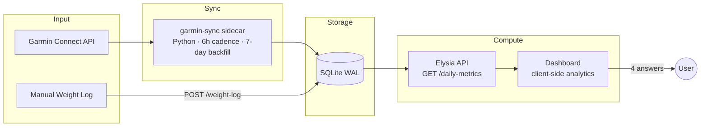

# Garmin Health Analytics — Reference

> Wearable-enriched health analytics. ~33 daily Garmin metrics distilled into 4 actionable answers.
> The goal is not to display raw data — it's to **answer questions and surface insights**.
>
> This doc is the analytics reference (the *what* and *why*). For chart implementation status,
> kind/primitive contracts, and migration phases, see [CHARTS-VISX-MIGRATION.md](./CHARTS-VISX-MIGRATION.md).

---

## The 4 Questions This Dashboard Answers

| # | Question | Composite signal | Min data |
|-|-|-|-|
| 1 | Am I recovered enough today? | Recovery Score (0–100) | 7 days |
| 2 | Am I getting fitter over time? | Fitness Direction (5-level) | 14 days |
| 3 | Am I training the right amount? | Daily Activity Score + ACWR | 14 days |
| 4 | How well am I sleeping? | Sleep Score + diverging stage stack | Immediate |

If a metric doesn't help answer one of these four, it's supporting context, not a primary view.

---

## Part 1 — Data Architecture

### 1.1 Flow



### 1.2 Source Data

`daily_metrics` — one row per day, all fields nullable.

| Category | Fields | Purpose |
|-|-|-|
| Activity | `steps`, `distance_m`, `total_kcal`, `active_kcal`, `floors_ascended`, `moderate_intensity_min`, `vigorous_intensity_min` | Daily Activity Score input |
| Heart Rate | `resting_hr`, `max_hr`, `min_hr` | Cardiovascular fitness trend |
| HRV | `hrv_last_night_avg`, `hrv_last_night_5min_high`, `hrv_weekly_avg`, `hrv_status` | Recovery capacity, autonomic load |
| Sleep | `sleep_score`, `sleep_duration_sec`, `deep_sleep_sec`, `light_sleep_sec`, `rem_sleep_sec`, `awake_sleep_sec`, `avg_sleep_stress`, `avg_sleep_hr`, `avg_sleep_respiration` | Sleep quality, recovery input |
| Stress & Energy | `avg_stress`, `max_stress`, `bb_highest`, `bb_lowest`, `bb_charged`, `bb_drained` | Energy balance |
| Respiration | `avg_waking_respiration` | Illness early warning |
| SpO2 | `avg_spo2`, `lowest_spo2` | Sleep apnea screening |
| Fitness | `vo2_max` | Cardiorespiratory fitness |

**Supporting tables:** `weight_log`, `user_profile`.

### 1.3 Design Constraints

- **All computation client-side.** API returns raw rows; the dashboard derives everything. Iterate on analytics without touching the API.
- **No per-workout HR streams.** Garmin syncs daily aggregates only. This rules out true TRIMP / Whoop-Strain (which need per-minute HR). We approximate effort via **MET-minutes** instead — see Part 2.
- **Null-safe everywhere.** Any field can be null on any day. Components degrade gracefully.

---

## Part 2 — Metric Definitions

### 2.1 Stored Metrics

Arrive raw from the Garmin Connect API. Schema documented in `packages/dashboard/src/pages/garmin-health/types.ts`.

### 2.2 Daily Activity Score (canonical effort metric)

The single source of truth for "how hard did I work today" — replaces the old TRIMP-style `mod×1 + vig×1.8` formula. Built from MET-multipliers per the **Compendium of Physical Activities** (Ainsworth et al. 2011), the citable standard for activity intensity scoring.

```
intensity_steps  = (moderate_min + vigorous_min) × 100   # de-double-count
walking_steps    = max(0, steps − intensity_steps)
walking_score    = walking_steps × 0.03                  # ≈3 MET, ~1 min per 100 steps
moderate_score   = moderate_min × 4                       # 4 MET (mid of 3–6 range)
vigorous_score   = vigorous_min × 8                       # 8 MET (mid of 6–10+ range)

score (MET-min)  = walking_score + moderate_score + vigorous_score
```

**Daily target:** 600 MET-min — the "100% day" reference. Calibrated for a sportive young adult. WHO's weekly floor is 500–1000 MET-min/week; 600/day sits ~3.5× that, consistent with trained athletes.

**Properties:**

- WHO's "1 vigorous = 2 moderate" weighting is preserved naturally (8/4 = 2).
- Walking earns score for low-intensity daily volume, not only structured workouts.
- Steps already counted as intensity-min (≈100 steps/min) are excluded from the walking term to avoid double counting.
- Bounded only by your activity — no artificial cap. A 90-min vigorous day legitimately scores ~720+.

**Reference values for a sportive young adult (45 vig min/day target):**

| Day type | vig | mod | steps | Score | % of target |
|-|-|-|-|-|-|
| Rest | 0 | 0 | 8 000 | 240 | 40% |
| Moderate | 0 | 45 | 10 000 | 480 | 80% |
| Active | 45 | 15 | 12 000 | 540 | 90% |
| Hard | 60 | 0 | 14 000 | 780 | 130% |

**Why MET-min beats Whoop Strain here:** Whoop's 0–21 strain requires per-minute HR. We don't have it. MET-min is reproducible from daily aggregates, well-validated in exercise science, and interpretable.

### 2.3 Single-Day Computed Metrics

Derived from one day, no historical context.

```
sleep_hours          = sleep_duration_sec / 3600
deep%/light%/rem%    = stage / (deep+light+rem+awake) × 100
sr_ratio             = bb_charged / bb_drained          # >1 = recovering
```

Sleep targets: deep 13–23%, REM 20–25%. Persistent low deep/REM may indicate alcohol, stress, or a sleep disorder.

### 2.4 Time-Series Metrics

**Moving averages** — `MA(field, N) = mean of last N non-null values`. Min 3 valid in window.
Used: RHR 7d MA, HRV 7d MA, Activity Score 30d MA.

**EWMA (exponentially weighted)** — Hulin et al. (2017, BJSM). Decays old values:

```
λ            = 2 / (N + 1)
ewma_today   = load × λ + ewma_prev × (1 − λ)

acute        λ = 2/(7+1)  = 0.250   (~7-day half-life)
chronic      λ = 2/(28+1) ≈ 0.069   (~28-day half-life)

seed         mean of first min(7, available) days
```

The `load` input here is the **Daily Activity Score** (MET-min) — same metric as the Activity card, so the page has one shared definition of effort.

### 2.5 ACWR (Acute:Chronic Workload Ratio)

```
ACWR = ewma_acute / ewma_chronic
```

| Range | Zone | Interpretation |
|-|-|-|
| < 0.8 | Undertrained | insufficient stimulus, detraining risk |
| 0.8–1.3 | Optimal | adaptation sweet spot |
| 1.3–1.5 | Caution | elevated injury risk |
| > 1.5 | Danger | high injury probability |

Thresholds from Gabbett (2016, BJSM). Strong empirical support for the >1.5 upper bound; the 0.8 lower bound is practitioner convention. Ratio is scale-invariant — switching the underlying load definition (TRIMP → MET-min) preserves zone meaning.

### 2.6 Load Divergence (MACD-style)

```
divergence = ewma_acute − ewma_chronic
```

Positive = building load (acute above baseline). Negative = shedding load (deload or detraining). Sign change = inflection point. Visual: green bars when positive, red when negative.

### 2.7 Recovery Score (0–100)

Weighted composite, with optional strain-context adjustment.

```
recovery_raw =
  hrv_component      × 0.35 +
  sleep_component    × 0.30 +
  rhr_component      × 0.20 +
  bb_component       × 0.15

  hrv_component   = min(100, (hrv_today / hrv_period_avg) × 100)
  sleep_component = sleep_score                                       (0–100)
  rhr_component   = (1 − (rhr − rhr_min) / (rhr_max − rhr_min)) × 100
  bb_component    = bb_highest                                        (0–100)

  Null components → redistribute weight proportionally.
```

**Strain-debt adjustment** (proposed; not yet implemented — see CHARTS-VISX-MIGRATION.md Phase A4):

```
strain_debt = clamp(0, 1, yesterday_score / 1000)
recovery    = recovery_raw × (1 − strain_debt × 0.20)
```

A maximum-effort yesterday (1 000 MET-min) drags today's recovery by 20%. A typical hard day (700) shaves ~14%. Rest days don't penalise.

**Zones:**

| Range | Verdict |
|-|-|
| ≥ 70 | **Push** — train hard, attempt intensity |
| 40–69 | **Normal** — standard session |
| < 40 | **Rest** — prioritise recovery |

### 2.8 Fitness Direction (5-level signal)

Linear-regression slope over the available window for RHR + HRV.

```
rhr_improving  = rhr_slope < −0.05 bpm/day
hrv_improving  = hrv_slope > +0.10 ms/day
rhr_declining  = rhr_slope > +0.05 bpm/day
hrv_declining  = hrv_slope < −0.10 ms/day

Accelerating   both improving
Improving      one improving, none declining
Maintaining    neither improving nor declining
Declining      one declining, none improving
Regressing     both declining
```

VO2 Max trend (when ≥2 measurements present) overrides: rising VO2 with flat RHR/HRV → still improving.

### 2.9 Sleep Score Bands (Garmin)

```
≥90  Excellent
80–89  Good
60–79  Fair
<60   Poor
```

---

## Part 3 — Composite Signals

### 3.1 Overtraining Signal

```
ACWR > 1.3
AND recovery_score < 50
AND (rhr_7d_MA rising OR hrv_7d_MA declining)
```

Confidence rises with: sleep score < 60 for 3+ days · avg_stress > 50 for 3+ days · BB never reaching 75 for 3+ days.

### 3.2 Detraining Signal

```
ACWR < 0.8
AND chronic_load declining
AND rhr trending up
```

### 3.3 Training-Recovery Alignment

The most actionable insight — is today's training appropriate for today's recovery state?

| Recovery | ACWR | Verdict |
|-|-|-|
| ≥ 70 | 1.0–1.3 | **Aligned · push** — recovered AND pushing → ideal |
| 40–69 | 0.8–1.0 | **Aligned · sustain** — moderate all around |
| < 40 | < 0.8 | **Aligned · deload** — resting AND reducing → correct |
| < 40 | > 1.3 | **Misaligned · risk** — exhausted AND pushing → injury |
| ≥ 70 | < 0.8 | **Misaligned · waste** — fully recovered, not training |

---

## Part 4 — Visualisation Strategy

### 4.1 Layout

```
┌────────────────────────────────────────────────────────────────┐
│ HERO ROW (3 composite cards — the three-second read)           │
│ [Recovery 74 Normal] [Fitness Improving] [ACWR 1.04 Optimal]   │
├────────────────────────────────────────────────────────────────┤
│ SECTION 1 · EFFORT & ADAPTATION (50/50)                        │
│ [Daily Activity (MET-min Score)]   [Fitness Trends]            │
├────────────────────────────────────────────────────────────────┤
│ SECTION 2 · TRAINING LOAD (50/50)                              │
│ [ACWR + zones]                     [Load Divergence (MACD)]    │
├────────────────────────────────────────────────────────────────┤
│ SECTION 3 · RECOVERY & SLEEP (50/50)                           │
│ [Recovery Trend + zones]           [Sleep Breakdown diverging] │
├────────────────────────────────────────────────────────────────┤
│ SECTION 4 · BODY STATE (50/50)                                 │
│ [Body Battery range]               [Stress Levels]             │
└────────────────────────────────────────────────────────────────┘
```

Activity sits next to Fitness Trends — pairs "what I did today" with "what my body is becoming". Training-load pair (ACWR + Divergence) reads as one story. The 33/33/33 supporting row is gone; everything is paired or hero.

### 4.2 Cross-Chart Hover Sync

`HoverContext` provider wraps the page. Hovering any chart's overlay broadcasts the date; every other chart draws a ghost crosshair at the same x. Direct hover also shows the tooltip. Implemented via `useHoverSync<T>` hook — never reimplement the closest-point loop inline.

### 4.3 Chart-Specific Treatments

| Chart | Visx kind / shape | Notes |
|-|-|-|
| Daily Activity | `Bars` (stacked) | 3 segments: walking (light) → moderate (dark green) → vigorous (orange). Header shows today's Score. 30d trend dashed grey on left axis. Target band ≥600. |
| Fitness Trends | bespoke dual-axis | RHR (left, inverted) + HRV (right) as 7-day MA lines, VO2 Max as orange dots. |
| ACWR | `ZonedLine` | 0.8/1.3/1.5 ref lines, optimal-zone band, threshold fills (green above 0.8 threshold, red above 1.3). |
| Load Divergence | bespoke dual-panel | Top: acute + chronic lines colour-flipping at crossover. Bottom: divergence histogram, green when positive. |
| Recovery Trend | `ZonedLine` | Push/Normal/Rest zone bands, threshold-fill above/below. |
| Sleep Breakdown | `Bars` (diverging) | Deep/Light/REM stack above baseline, Awake stack below. Sleep score line on right axis. Target band 7–9h. |
| Body Battery | bespoke (planned) | Filled high-low band via visx `<Threshold>`, ref line at 50. |
| Stress Levels | bespoke (planned) | Avg + sleep stress lines, ref lines at 25 and 50. |

---

## Part 5 — Tier System

| Tier | Content | Purpose |
|-|-|-|
| Tier 1 — Answers | 3 hero cards | Three-second read |
| Tier 2 — Evidence | All 8 charts | The data behind the answers |
| Tier 3 — Drill-down | Tooltip per chart | Specific values for any date |

The dashboard reads top-to-bottom: answer → evidence → date-level detail.

---

## Part 6 — Implementation Status

| Phase | Status | Notes |
|-|-|-|
| Data pipeline | ✅ done | garmin-sync sidecar (6h, 7-day backfill), 33-field daily_metrics, API CRUD, monitoring |
| Raw dashboard | ✅ done | 6 stat cards, 5 raw charts, ACWR + Load Balance, Fitness Trends, tooltip context |
| Composite hero cards | ✅ done | Recovery, Fitness Direction, Training Balance |
| Visx migration — primitives + ZonedLine + Bars | ✅ done | `AxisRightNumeric`, `Bars` kind (stacked/grouped, weights, dual axis), tokens, `VX.goodSoft`/`vigorousMin` |
| Sleep diverging redesign | ✅ done | Bars kind with negativeBars, target band, score line on right axis |
| Daily Activity → MET-min Score | ✅ done | Stacked walking/moderate/vigorous, 30d trend, header chip, target zone |
| **Activity tooltip cleanup + layout reorg** | ⏳ pending | Score → header only, drop duplicate rows. Activity moves 50/50 next to Fitness Trends. |
| **Unify computeTrainingLoad on MET-min** | ⏳ pending | Replaces `mod×1 + vig×1.8`; ACWR/Divergence use the same effort metric as Activity |
| **Recovery + strain-debt adjustment** | ⏳ pending | Optional; subtracts up to 20% based on yesterday's score |
| Migrate Fitness Trends to visx | ⏳ pending | Bespoke (single-instance dual-axis line + dot scatter) |
| Migrate Body Battery to visx | ⏳ pending | Bespoke (range band via `<Threshold>`) |
| Migrate Stress Levels to visx | ⏳ pending | Bespoke (area + line + ref lines) |
| Drop recharts entirely | ⏳ pending | After three remaining migrations land |

See `docs/CHARTS-VISX-MIGRATION.md` for phase-by-phase implementation prompts.

---

## References

| Source | Contribution |
|-|-|
| Ainsworth et al. (2011) — *Compendium of Physical Activities* | MET multipliers (8 vigorous, 4 moderate, 3 walking) |
| WHO (2020) — Physical Activity Guidelines | 1 vigorous min = 2 moderate; 500–1000 MET-min/week target |
| Hulin et al. (2017) — BJSM | EWMA model for ACWR, superior to rolling average |
| Gabbett (2016) — BJSM | Training-injury prevention, ACWR zone thresholds |
| Banister (1991) — TRIMP | Original training-impulse formula (now superseded here) |
| Firstbeat Analytics / Garmin | Body Battery, HRV Status algorithms |
| Whoop — *How Strain Works 101* | Confirmed Strain needs per-minute HR; informed why we use MET-min instead |
| Nature Sci Reports (2025) | HRV-guided training readiness |
| PMC8138569 (2021) | ACWR systematic review — upper threshold supported, lower less so |
