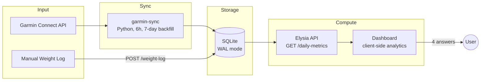

# Garmin Health Analytics — PRD

> Wearable-enriched health analytics. 33 daily Garmin metrics distilled into 4 actionable answers.
> The goal is not to display raw data — it's to answer questions and surface insights.

---

## The 4 Questions This Dashboard Answers

| # | Question | Composite Signal | Minimum data |
|-|-|-|-|
| 1 | Am I recovered enough today? | Recovery Score (0-100) | 7 days |
| 2 | Am I getting fitter over time? | Fitness Direction (5-level) | 14 days |
| 3 | Am I training the right amount? | Training Balance (ACWR) | 14 days |
| 4 | How well am I sleeping? | Sleep Quality | Immediate |

Everything in this document serves these 4 questions. If a metric or chart doesn't help answer one of them, it doesn't belong in the primary view.

---

## Part 1: Data Architecture

### 1.1 Data Flow



### 1.2 Source Data

**daily_metrics** — one row per day, 33 nullable fields:

| Category | Fields | Purpose |
|-|-|-|
| Activity | steps, distance_m, total_kcal, active_kcal, floors_ascended, moderate_intensity_min, vigorous_intensity_min | Training load input, activity tracking |
| Heart Rate | resting_hr, max_hr, min_hr | Cardiovascular fitness trend |
| HRV | hrv_last_night_avg, hrv_last_night_5min_high, hrv_weekly_avg, hrv_status | Recovery capacity, autonomic health |
| Sleep | sleep_score, sleep_duration_sec, deep_sleep_sec, light_sleep_sec, rem_sleep_sec, awake_sleep_sec, avg_sleep_stress, avg_sleep_hr, avg_sleep_respiration | Sleep quality, recovery input |
| Stress & Energy | avg_stress, max_stress, bb_highest, bb_lowest, bb_charged, bb_drained | Energy balance, stress load |
| Respiration | avg_waking_respiration | Illness early warning |
| SpO2 | avg_spo2, lowest_spo2 | Sleep apnea screening |
| Fitness | vo2_max | Cardiorespiratory fitness |

**Supporting tables:** weight_log (manual body weight), user_profile (height, birth_date, gender, goal_weight)

**Key design decisions:**
- **All computation is client-side** — the API returns raw rows, the dashboard derives everything. This keeps the API simple and allows iterating on analytics without API changes.
- **No per-workout HR streams** — Garmin syncs daily summaries only. Training load is approximated from intensity minutes, not EPOC or TRIMP.
- **Null-safe everywhere** — any field can be null on any day. Components gracefully degrade.

---

## Part 2: Metric Definitions

### 2.1 Stored Metrics (raw, from Garmin sync)

33 fields arrive as-is from the Garmin Connect API. See schema in CLAUDE.md for full field reference. All nullable — sensor availability varies by day and watch model.

### 2.2 Computed Metrics (per-day transformations)

Derived from single-day data. No historical context needed.

**Sleep Duration (hours)**
```
sleep_hours = sleep_duration_sec / 3600
```

**Sleep Stage Distribution (%)**
```
total_stages = deep + light + rem + awake
deep%  = deep / total_stages x 100
rem%   = rem / total_stages x 100
light% = light / total_stages x 100
```
Targets: Deep 13-23%, REM 20-25%. Consistently low deep or REM may indicate alcohol, stress, or sleep disorders.

**Weighted Intensity Load (daily training stress proxy)**
```
daily_load = moderate_intensity_min x 1.0 + vigorous_intensity_min x 1.8
```
The 1.8 vigorous multiplier derives from Banister zone-midpoint TRIMP weighting (%HRR ~0.72 vs ~0.55 for moderate). This is the best available proxy without per-workout HR streams.

**Stress-Recovery Ratio**
```
sr_ratio = bb_charged / bb_drained
```
Values > 1.0 = more recovery than drain. Consistently < 0.8 = chronic energy deficit.

### 2.3 Derived Metrics (time-series analysis)

Require historical data. Computed client-side from the daily metrics array.

**Moving Averages (MA)**
```
MA(field, N) = mean of last N non-null values

Used: RHR 7d MA, HRV 7d MA
Minimum 3 valid values within window required.
```

**EWMA (Exponentially Weighted Moving Average)**

From Hulin et al. (2017, BJSM). Decays older values exponentially — more sensitive to recent load changes than simple rolling averages.

```
lambda = 2 / (N + 1)
ewma_today = load x lambda + ewma_prev x (1 - lambda)

Acute:  lambda = 2/(7+1)  = 0.25    (~7-day half-life)
Chronic: lambda = 2/(28+1) = 0.069   (~28-day half-life)

Seed: mean of first min(7, available) days
```

**ACWR (Acute:Chronic Workload Ratio)**
```
ACWR = ewma_acute / ewma_chronic

Zones (Gabbett 2016, BJSM):
  < 0.8   Undertrained  — insufficient stimulus, detraining risk
  0.8-1.3 Optimal       — adaptation sweet spot
  1.3-1.5 Caution       — elevated injury risk
  > 1.5   Danger        — high injury probability
```
The >1.5 threshold has strong empirical backing. The 0.8-1.3 "sweet spot" is practitioner convention — the lower bound is less evidence-based than the upper.

**Load Divergence (MACD-style)**
```
divergence = ewma_acute - ewma_chronic

Positive = building load (acute rising above baseline)
Negative = shedding load (detraining or recovery phase)
Crossover (sign change) = load direction inflection point
```
Inspired by the MACD indicator from technical analysis. The divergence histogram shows the rate and direction of load change. Green bars when building, red when shedding.

**Recovery Score (0-100)**

Weighted composite of 4 inputs, each normalized against the period baseline:

```
recovery = (
  hrv_component  x 0.35 +
  sleep_component x 0.30 +
  rhr_component  x 0.20 +
  bb_component   x 0.15
)

where:
  hrv_component  = min(100, (hrv_today / hrv_period_avg) x 100)
  sleep_component = sleep_score  (already 0-100)
  rhr_component  = (1 - (rhr - rhr_min) / (rhr_max - rhr_min)) x 100
  bb_component   = bb_highest  (already 0-100, morning peak energy)

If a component is null, redistribute its weight proportionally.

Zones:
  >= 70  Push   — train hard, attempt intensity
  40-69  Normal — standard session
  < 40   Rest   — prioritize recovery
```

**Fitness Direction (5-level signal)**

Combines RHR and HRV trend slopes over the available data window:

```
rhr_slope = linear regression slope of RHR values
hrv_slope = linear regression slope of HRV values

rhr_improving = rhr_slope < -0.05 bpm/day
hrv_improving = hrv_slope > 0.1 ms/day
rhr_declining = rhr_slope > 0.05 bpm/day
hrv_declining = hrv_slope < -0.1 ms/day

Signal:
  Accelerating    both improving
  Improving       one improving, neither declining
  Maintaining     neither improving nor declining
  Declining       one declining, neither improving
  Regressing      both declining
```

VO2 Max trend can override when available (>=2 measurements): rising VO2 Max with flat RHR/HRV = still improving.

---

## Part 3: Composite Signals

### 3.1 Overtraining Detection

No single metric reliably detects overtraining. Combining signals:

```
Overtraining signal =
  ACWR > 1.3                                     — load spike
  AND recovery_score < 50                         — poor recovery
  AND (rhr_7d_ma rising OR hrv_7d_ma declining)   — physiological stress

Confidence increases with:
  - Sleep score < 60 for 3+ consecutive days
  - avg_stress > 50 for 3+ consecutive days
  - Body battery failing to reach 75 for 3+ days
```

### 3.2 Detraining Detection

```
Detraining signal =
  ACWR < 0.8                  — insufficient load
  AND chronic_load declining  — capacity dropping
  AND rhr_trending_up         — cardiovascular deconditioning
```

### 3.3 Training-Recovery Alignment

The most actionable insight: is today's training level appropriate for today's recovery state?

```
Aligned (good):
  Recovery >= 70  + ACWR 1.0-1.3   — recovered AND pushing = ideal
  Recovery 40-69  + ACWR 0.8-1.0   — moderate all around = sustainable
  Recovery < 40   + ACWR < 0.8     — resting AND reducing = correct deload

Misaligned (warning):
  Recovery < 40   + ACWR > 1.3     — exhausted AND pushing = injury risk
  Recovery >= 70  + ACWR < 0.8     — fully recovered, not training = wasted potential
```

---

## Part 4: Visualization Strategy

### 4.1 Dashboard Layout

```
+--------------------------------------------------------------+
|  HERO ROW (3 composite cards — the three-second read)        |
|  [Recovery: 74 Normal] [Fitness: Improving] [ACWR: 1.04]     |
+--------------------------------------------------------------+
|  SECTION 1: FITNESS PROGRESSION (full width)                 |
|  RHR 7d MA + HRV 7d MA + VO2 Max dots                       |
|  Faint daily dots + bold trend lines                         |
+-------------------------------+------------------------------+
|  SECTION 2: TRAINING LOAD    |                              |
|  [ACWR ratio + zone bands]   | [Load MACD — divergence]    |
+-------------------------------+------------------------------+
|  SECTION 3: RECOVERY & SLEEP                                |
|  [Recovery trend + zones]    | [Sleep stages + score]       |
+-------------------------------+------------------------------+
|  SECTION 4: SUPPORTING METRICS (secondary)                   |
|  [Body Battery range]  [Stress levels]  [Steps + Activity]  |
+--------------------------------------------------------------+
```

### 4.2 Advanced Chart Techniques

**Synced Cursors**
All charts share `syncId="garmin"`. Hovering any chart highlights the same date across all charts simultaneously. This enables cross-metric correlation at a glance — see how a recovery dip corresponds to a training spike on the same day.

**MACD-Style Divergence (Training Load)**
Two-panel stacked chart:
- Top panel: Acute (orange) + Chronic (red) signal lines
- Bottom panel: Divergence histogram (acute - chronic)
  - Green bars when positive (building load)
  - Red bars when negative (shedding load)
  - Crossover points indicate load direction changes
- Both panels synchronized via syncId. Top hides x-axis labels.

**Gradient Zone Fills (Recovery Trend)**
- Background ReferenceAreas: green (70-100), yellow (40-70), red (0-40)
- Area chart with vertical SVG gradient: green at top fading to red at bottom
- Creates intuitive visual: high recovery = green area, low = red area

**Faint/Bold Overlay (Fitness Trends)**
- Daily values as small dots with 25% opacity (noise layer)
- 7-day moving average as bold 2.5px lines (signal layer)
- VO2 Max as prominent orange dots with white border (sparse events)
- RHR on reversed Y-axis (lower = top = better)
- Dual Y-axes: bpm (left, inverted) and ms (right, normal)

**Dynamic Bar Coloring**
Using Recharts `<Cell>` component to color individual bars based on value:
- Positive divergence bars → green
- Negative divergence bars → red
- ACWR threshold coloring → zone-based

### 4.3 Mobile Behavior

All chart rows collapse to single-column on `< 768px`. Hero cards shrink to show value + label only. Chart heights reduce proportionally.

---

## Part 5: What's Displayed vs. What's Input

| Tier | Content | Purpose |
|-|-|-|
| **Tier 1 — Answers** | 3 hero cards (Recovery, Fitness, Training) | Three-second read |
| **Tier 2 — Evidence** | Fitness Trends, ACWR, Load MACD, Recovery Trend, Sleep | The data behind the answers |
| **Tier 3 — Supporting** | Body Battery, Stress, Activity | Raw inputs for drill-down |

The dashboard reads top-to-bottom as: answer → evidence → supporting data.

---

## Part 6: Implementation Phases

### Phase 1 — Data Pipeline (done)
- garmin-sync container (Python, 6h interval, 7-day backfill)
- 33-field daily_metrics table with null-safe upserts
- API routes (GET /daily-metrics, CRUD /weight-log, GET+PUT /user-profile)
- UptimeKuma monitoring, Slack alerts

### Phase 2 — Raw Dashboard (done)
- 6 raw stat cards (sleep, BB, HRV, RHR, steps, stress)
- 5 raw metric charts (sleep stages, body battery, HR/HRV, stress, activity)
- ACWR + Load Balance charts
- Fitness Trends chart (RHR/HRV moving averages)
- Health-context tooltips on every metric

### Phase 3 — Analytics Dashboard (current)
- 3 composite hero cards (Recovery Score, Fitness Direction, Training Balance)
- MACD-style training load chart (two-panel: lines + divergence histogram)
- Recovery Score trend chart with gradient zone fills
- Synced cursors across all charts
- Restructured layout: answers → evidence → supporting
- Fitness Direction with linear regression slope analysis

---

## References

| Source | Contribution |
|-|-|
| Hulin et al. (2017) — BJSM | EWMA model for ACWR, superior to rolling average |
| Gabbett (2016) — BJSM | Training-injury prevention paradox, ACWR zone thresholds |
| Banister (1991) — TRIMP | Training impulse formula, HR zone weighting |
| Firstbeat Analytics / Garmin | Body Battery, Training Load, HRV Status algorithms |
| PMC8138569 (2021) | ACWR systematic review — upper threshold well-supported, lower less so |
| Nature Scientific Reports (2025) | HRV-guided training readiness |
| WHO (2020) | Physical activity guidelines (150-300 moderate min/week) |
| Bevel Health | ACWR visualization patterns, Load Balance concept |
