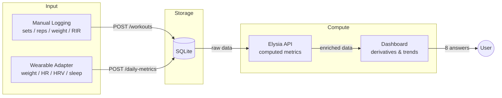
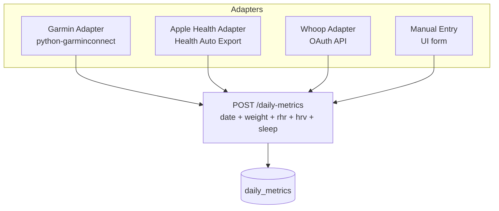
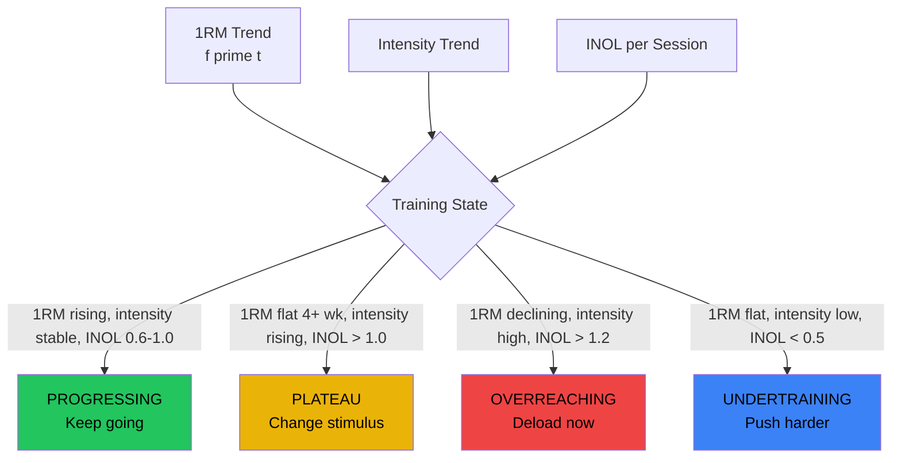

# Strength Tracker v2 — PRD

> Science-based strength training analytics. Manual workout logging + optional wearable enrichment.
> The goal is not to display raw data — it's to answer questions and surface insights.

---

## The 8 Questions This Dashboard Answers

| # | Question | Core metric | Requires wearable? |
|-|-|-|-|
| 1 | Am I getting stronger? | 1RM trend | No |
| 2 | How fast is my progress? | 1st derivative of 1RM | No |
| 3 | Is my progress accelerating or fading? | 2nd derivative (momentum) | No |
| 4 | Am I training smart or just hard? | INOL (load quality) | No |
| 5 | Which exercises are lagging? | Relative progression % | No |
| 6 | Are my lifts balanced? | Strength ratios vs. norms | No |
| 7 | Am I recovered enough to push? | Readiness composite | Yes |
| 8 | When should I deload? | Fatigue accumulation signals | Partial (better with wearable) |

Everything in this document serves these 8 questions. If a metric or chart doesn't help answer one of them, it doesn't belong.

---

## Part 1: Data Architecture

### 1.1 Data Flow



### 1.2 Schema

**Core tables — always available, manual input:**

```sql
exercises
  id            TEXT PRIMARY KEY      -- "bench_press", "deadlift", "squat", "pull_ups"
  name          TEXT NOT NULL         -- "Bench Press"
  category      TEXT NOT NULL         -- "push" | "pull" | "legs"
  muscle_group  TEXT NOT NULL         -- "chest" | "back" | "quads" | "glutes"
  is_bodyweight INTEGER DEFAULT 0    -- 1 for pull-ups, dips, etc.

workouts
  id            INTEGER PRIMARY KEY
  date          TEXT NOT NULL         -- YYYY-MM-DD
  exercise_id   TEXT NOT NULL → exercises(id)
  notes         TEXT
  rir           INTEGER              -- Reps in Reserve (0-5), optional
  created_at    TEXT

workout_sets
  id            INTEGER PRIMARY KEY
  workout_id    INTEGER NOT NULL → workouts(id) CASCADE
  set_number    INTEGER NOT NULL
  set_type      TEXT NOT NULL         -- "warmup" | "work" | "drop"
  weight_kg     REAL NOT NULL
  reps          INTEGER NOT NULL
```

**Wearable table — device-agnostic, optional enrichment:**

```sql
daily_metrics
  date          TEXT PRIMARY KEY      -- YYYY-MM-DD (one row per day)
  weight_kg     REAL                  -- body weight
  resting_hr    INTEGER               -- beats per minute
  hrv           REAL                  -- RMSSD in milliseconds
  sleep_score   INTEGER               -- 0-100 normalized
  source        TEXT                  -- "garmin" | "apple" | "whoop" | "manual"
```

**Key design decisions:**

- **`exercises` is a reference table**, not an enum — add exercises without schema changes
- **`rir` lives on `workouts`**, not per-set — matches how lifters think ("that session was an 8")
- **`daily_metrics` is one table with 4 fields** — not three Garmin-specific tables. Any wearable or manual entry can write to it. The dashboard doesn't know or care about the source
- **No Garmin activity linking** — we don't track HR during workouts (marginal value for strength). Garmin is only for daily body/recovery data
- **Body weight from `daily_metrics`** replaces the hardcoded 70kg pull-up constant. Falls back to last known weight, then to a configurable default

### 1.3 Wearable Adapter Pattern



**First adapter: Garmin** (Python sidecar, daily cron, `python-garminconnect`)
- 4 API calls: `get_body_composition()`, `get_heart_rates()`, `get_hrv_data()`, `get_sleep_data()`
- No FIT file parsing needed — we don't import workout data from Garmin
- Auth: interactive login once, token persists ~1 year as Docker volume

Adding a new wearable = writing a script that POSTs 4 numbers to one endpoint.

---

## Part 2: Metric Definitions

### 2.1 Stored Metrics (raw, from user input)

These come directly from the sets the user logs:

| Field | Source |
|-|-|
| `weight_kg` | Per set |
| `reps` | Per set |
| `set_type` | Per set (warmup/work/drop) |
| `rir` | Per workout (optional, 0-5) |

### 2.2 Computed Metrics (API, per workout)

Computed on read from sets. The API returns these alongside the raw data.

**Estimated 1RM** — strength capacity from sub-maximal sets

Uses the best (highest 1RM) work set per workout. Two formulas averaged:

```
Brzycki:  1RM = W x 36 / (37 - R)        — best for R < 6 (strength sets)
Epley:    1RM = W x (1 + R / 30)          — best for R = 6-10 (hypertrophy sets)
Final:    1RM = avg(Brzycki, Epley)        — when both valid
```

For bodyweight exercises (pull-ups): `W = weight_kg + body_weight` where body_weight comes from `daily_metrics` (nearest date), falling back to a configured default.

**Volume Load** — total mechanical work

```
Volume = sum( effective_weight x reps )    — all sets (warmup + work + drop)
```

**Max Weight** — heaviest work set

```
Max Weight = max( weight_kg )              — work sets only
```

**Average Intensity** — effort relative to capacity

```
Intensity = avg( set_weight / 1RM ) x 100  — work sets only, as percentage
```

**INOL (Intensity Number of Lifts)** — load quality score

```
INOL = sum( reps / (100 - %1RM) )          — per workout, work sets only

where %1RM = (set_weight / estimated_1rm) x 100
```

INOL is the single best metric for training quality. It penalizes junk volume (lots of easy reps) and rewards effective loading (fewer reps at meaningful intensity):

| INOL | Interpretation |
|-|-|
| < 0.4 | Too easy — not enough stimulus |
| 0.4 - 0.6 | Light — recovery / deload range |
| **0.6 - 1.0** | **Optimal — effective training** |
| 1.0 - 1.5 | Hard — sustainable short-term |
| > 1.5 | Excessive — high fatigue risk |

**Relative Strength** — bodyweight-normalized (requires `daily_metrics`)

```
Relative Strength = 1RM / body_weight
```

This is critical: a 100kg bench at 80kg bodyweight (RS=1.25) is more impressive than 110kg at 100kg (RS=1.10). Without bodyweight tracking, you can't distinguish "got stronger" from "got heavier."

### 2.3 Derived Metrics (client-side, from time series)

These operate on the time series of computed metrics above. Calculated in the dashboard from the workout history.

**First Derivative — Velocity of Progress**

Rolling linear regression slope over a 4-week window:

```
f'(t) = d(1RM) / dt

Computed as: linear regression slope of 1RM values
             within [t - 28 days, t]
```

| f'(t) | Meaning |
|-|-|
| > 0 | Progressing — gaining strength |
| ~ 0 | Plateau — no change |
| < 0 | Regressing — losing strength |

**Second Derivative — Momentum (Acceleration of Progress)**

Slope of the first derivative over another 4-week window:

```
f''(t) = d(f'(t)) / dt = d^2(1RM) / dt^2

Computed as: linear regression slope of f'(t) values
             within [t - 28 days, t]
```

| f''(t) | f'(t) | State | What's happening |
|-|-|-|-|
| > 0 | > 0 | Accelerating | Gains are speeding up (newbie gains, post-deload rebound) |
| ~ 0 | > 0 | Linear progress | Steady gains (sustainable, ideal) |
| < 0 | > 0 | Decelerating | Still gaining but slowing down (approaching ceiling) |
| < 0 | ~ 0 | Stalling | About to plateau (change stimulus or deload) |
| < 0 | < 0 | Regressing | Losing strength (overtraining, life stress, insufficient recovery) |

This is the Kurvendiskussion applied to training: the first derivative tells you *where* you are, the second derivative tells you *where you're heading*.

**Momentum Indicator**

Visual summary combining both derivatives into a single signal:

```
Signal = classify(f'(t), f''(t))

  ▲▲  Accelerating    f' > 0 and f'' > 0
  ▲   Steady gains    f' > 0 and f'' ~ 0
  ►   Plateau         f' ~ 0
  ▼   Decelerating    f' > 0 and f'' < 0 (or f' ~ 0 and f'' < 0)
  ▼▼  Regressing      f' < 0
```

---

## Part 3: Composite Signals

These combine multiple metrics to answer higher-level questions.

### 3.1 Training State Detection

No single metric reliably detects plateaus (too many false positives). Combining 3 signals:



### 3.2 Deload Signal (enhanced with wearable)

Without wearable — based on training data only:

```
Deload signal = (1RM flat or declining for >= 3 weeks)
                AND (INOL trending > 1.0)
                AND (intensity rising while 1RM not)
```

With wearable — adds physiological confirmation:

```
Deload signal = above training signals
                OR (resting HR trending up > 5 bpm above 30-day baseline)
                OR (HRV trending down > 15% below 30-day baseline for > 5 days)
                OR (sleep score < 60 for > 5 of last 7 days)
```

The wearable doesn't unlock a different signal — it makes the same signal **earlier and more reliable**. You catch fatigue accumulation *before* it shows up as a 1RM plateau.

Research consensus (2024 Delphi study): deload every 4-8 weeks, ~1 week duration, reduce volume 40-50% while maintaining 60-70% intensity.

### 3.3 Readiness Score (wearable only)

```
Readiness = weighted_composite(
  hrv_vs_baseline   x 0.4,    -- HRV compared to 30-day rolling baseline
  sleep_score       x 0.35,   -- normalized 0-100
  rhr_vs_baseline   x 0.25    -- inverted: lower RHR = better readiness
)

Simplified to 3 states:
  PUSH     = readiness >= 70    -- train hard, attempt PRs
  MODERATE = 40 <= readiness < 70  -- normal session, moderate intensity
  RECOVER  = readiness < 40     -- light session or rest
```

### 3.4 Exercise Balance Analysis

Normative strength ratios from 809,986 competition entries:

```
Expected ratios:
  Deadlift / Squat  = 1.0 - 1.25
  Squat / Bench     = 1.2 - 1.5
  Deadlift / Bench  = 1.5 - 2.0

Current ratio = 1RM(exercise_A) / 1RM(exercise_B)

Status:
  BALANCED   = ratio within expected range
  IMBALANCED = ratio outside range by > 15%
  CRITICAL   = ratio outside range by > 30%
```

Relative progression (% change from baseline) per exercise reveals which lifts are advancing and which are stuck, independent of absolute numbers.

---

## Part 4: Visualization Strategy

### 4.1 Dashboard Layout

```
┌─────────────────────────────────────────────────────────────┐
│  OVERVIEW BAR (all exercises, always visible)               │
│  [Bench ▲ +8%] [Squat ▲▲ +14%] [Dead ► 0%] [Pulls ▼ -3%] │
├────────────────────────────────┬────────────────────────────┤
│                                │                            │
│  PRIMARY VIEW                  │  SIDEBAR                   │
│  (single exercise or           │  - Workout form            │
│   comparison view)             │  - Recent PRs              │
│                                │  - Readiness (if wearable) │
│                                │                            │
├────────────────────────────────┴────────────────────────────┤
│  SECONDARY CHARTS (contextual, based on active view)        │
└─────────────────────────────────────────────────────────────┘
```

**Overview bar** — always visible, one badge per exercise:
- Momentum arrow (▲▲ / ▲ / ► / ▼ / ▼▼) from derivative analysis
- Relative progression % since filter start date
- Color: green / yellow / red based on training state
- Click to select exercise for primary view

### 4.2 Single Exercise View

One exercise at a time. Chart presets — each tells a different story:

**Strength (default)**

```
  Left axis:  1RM trend line + 30-day moving average
  Right axis: Avg intensity (%)
  Below:      Momentum bar (color gradient from derivatives)
  Insight:    "Am I getting stronger, and at what cost?"
              Divergence (1RM flat + intensity rising) = plateau
```

**Volume**

```
  Main:       Weekly volume load (bar chart, stacked by set type)
  Overlay:    Work set count (line)
  Insight:    "Am I progressively overloading?"
              Rising volume with flat 1RM = junk volume
```

**Efficiency**

```
  Left axis:  1RM trend
  Right axis: INOL per session
  Band:       Shaded optimal zone (0.6 - 1.0)
  Insight:    "Is my training effective or am I just accumulating fatigue?"
              INOL consistently > 1.2 without 1RM gains = overreaching
```

**Momentum**

```
  Top:        1RM with 4-week projection (dashed line from f'(t) slope)
  Bottom:     Stacked area: f'(t) and f''(t)
              Green zone = both positive (accelerating)
              Yellow zone = f' positive, f'' negative (decelerating)
              Red zone = f' negative (regressing)
  Insight:    "Is my progress speeding up, steady, or fading?"
              This is the Kurvendiskussion view
```

**Recovery (requires wearable)**

```
  Top:        Readiness score (area chart, 3-color zones)
  Bottom:     Workout markers (dots sized by INOL) overlaid on HRV trend
  Insight:    "Am I training in sync with my recovery?"
              Heavy session on low-readiness day = risky
              Pattern: which volume/intensity combos cost the most recovery?
```

### 4.3 Comparison View

Multi-exercise analysis — a separate view mode, not crammed into the exercise view:

**Relative Progression Chart**

```
  All exercises normalized to 100% at filter start date
  Line chart showing % change over time
  Example: Bench +18%, Squat +12%, Deadlift +3%, Pull-ups -2%
  Instantly shows: which lifts are advancing, which need attention
```

**Strength Ratio Dashboard**

```
  Horizontal bar chart per ratio pair
  Green zone = normative range, current value marked

  Deadlift/Squat:  |---[====|===========]------|  1.15 (normal)
  Squat/Bench:     |---[====|=======]----------|  1.10 (low - leg weakness?)
  Deadlift/Bench:  |---[====|===============]--|  1.85 (normal)
```

**Sparkline Grid**

```
  ┌───────────┬──────────┬──────────┬──────────┬──────────┬────────┐
  │ Exercise  │ 1RM      │ Volume   │ INOL     │ Momentum │ Status │
  ├───────────┼──────────┼──────────┼──────────┼──────────┼────────┤
  │ Bench     │ ~~~~/~~  │ ~~~/~~~  │ ~~.~~~~  │ ▲  +8%   │ green  │
  │ Squat     │ ~~~~//// │ ~~~/~~~  │ ~~.~~~~  │ ▲▲ +14%  │ green  │
  │ Deadlift  │ ~~~~~~~~ │ ~~~\~~~  │ ~~.~~~~  │ ►   0%   │ yellow │
  │ Pull-ups  │ ~~~~\~~~ │ ~~~\~~~  │ ~~.~~~~  │ ▼  -3%   │ red    │
  └───────────┴──────────┴──────────┴──────────┴──────────┴────────┘
  One row per exercise. Compact. Scannable in 2 seconds.
```

### 4.4 Period Analysis (Mesocycle Blocks)

4-week blocks shown as comparison cards:

```
  ┌─ Block 3 (current) ──────┐  ┌─ Block 2 ──────────────────┐
  │ Volume:  12,400 kg (+8%) │  │ Volume:  11,500 kg (+5%)   │
  │ Intensity: 78% (+2%)    │  │ Intensity: 76% (+1%)       │
  │ Avg INOL: 0.82          │  │ Avg INOL: 0.75             │
  │ 1RM delta: +3.2%        │  │ 1RM delta: +4.1%           │
  │ State: DECELERATING      │  │ State: PROGRESSING          │
  └──────────────────────────┘  └─────────────────────────────┘
```

---

## Part 5: What's New vs. Current MVP

| Current (v1) | New (v2) | Why |
|-|-|-|
| 4 hardcoded exercises | `exercises` reference table | Add exercises without code changes |
| No INOL | INOL per workout | Distinguishes quality training from junk volume |
| No derivatives | f'(t) and f''(t) on 1RM | Answers "where am I heading?" not just "where am I" |
| Multi-exercise charts | Single-exercise + comparison view | Cleaner insights, right tool for right question |
| No body weight | `daily_metrics` table | Unlocks relative strength, fixes pull-up calc |
| No recovery data | Wearable adapter → readiness | Catches fatigue before it becomes a plateau |
| Hardcoded 70kg pull-up BW | Dynamic from `daily_metrics` | Accurate volume/1RM for bodyweight exercises |
| No training state | Multi-signal detection | Green/yellow/red per exercise with deload timing |
| No exercise comparison | Relative progression + ratios | "Bench +18%, Deadlift +3%" at a glance |
| No chart presets | 5 presets (Strength/Volume/Efficiency/Momentum/Recovery) | Each tells a different story about the same data |

### What stays the same

- Manual workout logging (sets/reps/weight) — the core input
- SQLite database — perfect for single-user
- Elysia API + React dashboard architecture
- Brzycki + Epley 1RM estimation
- PR detection and tracking
- Workout form with auto-load last session

---

## Part 6: Implementation Phases

### Phase 1 — Foundation

- Export existing 2 workouts as JSON backup
- New schema: `exercises` table, `daily_metrics` table, `rir` field on workouts
- Migrate existing data (map text exercise names to exercise IDs)
- Add INOL computation to API response
- Add manual weight entry to UI (simplest wearable path)

### Phase 2 — Derivative Analytics

- Client-side 4-week rolling linear regression for f'(t) and f''(t)
- Momentum indicators on overview bar (per exercise)
- Training state detection (progressing / plateau / overreaching / undertraining)
- Chart presets: Strength, Volume, Efficiency, Momentum

### Phase 3 — Comparison View

- Relative progression chart (normalized % change)
- Strength ratio dashboard with normative ranges
- Sparkline grid
- Period/mesocycle block comparison

### Phase 4 — Wearable Integration

- Garmin adapter (Python sidecar, `python-garminconnect`, daily cron)
- Readiness score composite
- Recovery preset chart
- Enhanced deload signal with physiological data
- Dynamic bodyweight for all calculations

---

## References

| Source | Contribution |
|-|-|
| Brzycki (1993), Epley — NSCA Journal | 1RM estimation formulas |
| Hristov — INOL framework | Load quality scoring |
| IPF (2020) — GL Points formula | Bodyweight-normalized strength comparison |
| Schoenfeld et al. (2024) — JSCR | Volume-hypertrophy dose-response |
| Israetel — RP Strength (2023) | Volume landmarks (MEV/MAV/MRV) |
| Helms et al. (2023) — MASS Review | RIR methodology and accuracy |
| Nature Scientific Reports (2025) | HRV-guided training readiness |
| PMC Delphi study (2024) | Deload timing consensus (every 4-8 weeks) |
| PubMed (2024) — 809,986 entries | Normative powerlifting strength ratios |
