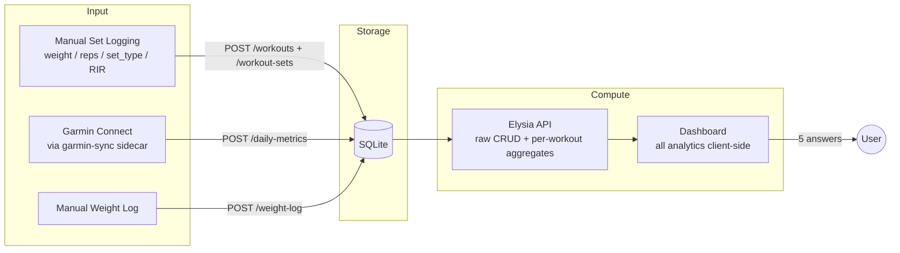

# Strength Tracker v2 — Analytics Reference

> Periodization instrument for the key compound lifts. Manual set-level logging, wearable-enriched
> readiness. The goal is not to display raw data — it's to **answer questions and surface insights**.
>
> This doc is the analytics reference (the *what* and *why*). For the phased implementation plan
> (ralph groups), see [STRENGTH-MIGRATION.md](./STRENGTH-MIGRATION.md).

---

## Scope

This app tracks **the key compound lifts you want to get stronger at** — bench press, squat,
deadlift, weighted pull-ups today; extensible via the `exercises` reference table tomorrow (OHP,
front squat, RDL…). Isolation work and accessory exercises are not first-class citizens. Every
chart, hero card, and signal is designed around: *am I progressing on the lifts that matter?*

The app is greenfield — prior data is backed up separately, so schema changes don't need
migrations. Break things, iterate freely.

---

## Lessons carried over from Garmin Health

The Garmin Health page is the pattern reference. These are the specific learnings that shape every
decision below; if something here conflicts with Garmin Health, Garmin Health wins.

| Learning | Where it applies to strength |
|-|-|
| **One concept, one name** — hero label = section title = chart title. | "Strength Direction", "Training Load", "Readiness" — each used in exactly one place with one meaning. |
| **6-word subtitle per chart** — every `ChartCard` carries the question it answers. | "Am I getting stronger?", "Is my load sustainable?", "Am I loading smart?" |
| **Header extra on every chart** — today's reading + verdict in the card's top-right slot. | Latest 1RM + momentum arrow, current weekly tonnage + zone, INOL of last session, etc. |
| **Personal z-scores for dissimilar scales** — the Fitness Trends fix for RHR/HRV/VO2. | Strength Composite plots 1RM-velocity, tonnage-growth, and INOL-quality on one σ axis. |
| **EWMA > rolling mean** for training load (Hulin 2017). | Acute 7d / chronic 28d tonnage drives the strength ACWR. |
| **Dynamic personal ceilings** — p90 of your own history, not hardcoded thresholds. | MEV/MAV/MRV per exercise from p10/p50/p90 of your own weekly work-set count. |
| **MACD-style acute−chronic divergence**. | Weekly tonnage divergence histogram — reveals accumulation vs peaking phases. |
| **Fatigue-debt adjustment** on recovery (strain-debt analog). | Yesterday's INOL and tonnage dampen today's "push" verdict. |
| **Cross-chart hover sync** via `HoverContext` + `useHoverSync`. | Every chart on the page snaps to the same session date on hover. |
| **Visx primitives only** — `ChartCard`, `ChartLegend`, `ChartTooltip`, `ZonedLine`, `Bars`, `VX`. | No recharts. No raw hex. No `localStorage.getItem('theme')`. |
| **Client-side analytics** — API returns raw rows, dashboard derives everything. | Iteration on formulas doesn't require an API deploy. |

---

## The 5 Questions This Dashboard Answers

| # | Question | Composite signal | Min data | Wearable? |
|-|-|-|-|-|
| 1 | Am I getting stronger on the lifts I care about? | **Strength Direction** — per-lift 3-level verdict from velocity + momentum | 4 weeks | No |
| 2 | Am I loading smart or just hard? | **Load Quality** — INOL zones + fatigue-adjusted tonnage ACWR | 2 weeks | No |
| 3 | Are my lifts balanced? | **Balance** — DOTS-adjusted strength ratios against norms | 1 session per lift | No |
| 4 | Should I push, sustain, or deload *today*? | **Readiness × Strain** — training state + physiological readiness | 2 weeks | Partial (better with wearable) |
| 5 | When should I deload? | **Deload Signal** — stall + fatigue + physiological confirmation | 3 weeks | Partial |

Every chart, badge, or number in the dashboard serves one of these five questions. If it doesn't,
it's not on the page.

---

## Part 1 — Data Architecture

### 1.1 Flow



### 1.2 Schema

Core tables — always available, manual input:

```sql
exercises
  id            TEXT PRIMARY KEY      -- "bench_press", "deadlift", "squat", "pull_ups"
  name          TEXT NOT NULL         -- "Bench Press"
  category      TEXT NOT NULL         -- "push" | "pull" | "legs" | "hinge"
  muscle_group  TEXT NOT NULL         -- "chest" | "back" | "quads" | "glutes" | "posterior"
  is_bodyweight INTEGER DEFAULT 0     -- 1 for pull-ups, dips, etc.
  display_order INTEGER               -- sort order in UI

workouts
  id            INTEGER PRIMARY KEY
  date          TEXT NOT NULL         -- YYYY-MM-DD
  exercise_id   TEXT NOT NULL → exercises(id)
  notes         TEXT
  rir           INTEGER               -- Reps in Reserve (0–5) for the TOP work set, optional
  created_at    TEXT

workout_sets
  id            INTEGER PRIMARY KEY
  workout_id    INTEGER NOT NULL → workouts(id) CASCADE
  set_number    INTEGER NOT NULL
  set_type      TEXT NOT NULL         -- "warmup" | "work" | "drop" | "amrap"
  weight_kg     REAL NOT NULL
  reps          INTEGER NOT NULL
```

Wearable tables — already shipped for Garmin Health, reused here:

- `daily_metrics` — body state (HRV, RHR, sleep, BB). Source of truth for readiness.
- `weight_log` — manual body weight entries. Falls back to nearest `daily_metrics.weight_kg` if
  not present; falls back to `user_profile` configured default.
- `user_profile` — height, gender, birthdate. Feeds DOTS normalization.

### 1.3 Design constraints

- **`exercises` is a reference table**, not a TS enum. Adding a new key lift is a row insert.
- **`rir` lives on `workouts`** (per session), not per set. Matches how lifters think ("that session
  was a top set at RIR 2"). Per-set RIR can be added later if needed — start simple.
- **`amrap` as a set_type** — the last set of a 5/3/1 or similar template, taken to near-failure.
  Counts as `work` for all aggregates but is flagged for e1RM estimation (see 2.3).
- **All analytics client-side.** API returns raw rows + a few per-workout aggregates that need the
  sets to compute (max weight, best-set e1RM, total volume). Everything else — derivatives, ACWR,
  ratios, readiness — is derived in the dashboard.
- **Body weight is dynamic.** `effective_weight(set, date) = is_bodyweight ? set.weight_kg +
  bw(date) : set.weight_kg`, where `bw(date)` walks `weight_log → daily_metrics → profile default`
  in that order.
- **Null-safe everywhere.** RIR, body weight, and every wearable field can be null on any day.

---

## Part 2 — Metric Definitions

### 2.1 Stored metrics (per set, per workout)

| Field | Per | Source |
|-|-|-|
| `weight_kg` | set | UI |
| `reps` | set | UI |
| `set_type` | set | UI (`warmup` / `work` / `drop` / `amrap`) |
| `rir` | workout | UI (optional, 0–5) |
| `body_weight_kg(date)` | day | `weight_log` → `daily_metrics` → profile default |

### 2.2 Estimated 1RM (the canonical strength measure)

Two formulas, averaged, with strict validity gates. We **do not** trust e1RM from every set — it's
unstable at rep extremes.

```
Brzycki: e1RM = W × 36 / (37 − R)           — valid for R ∈ [1, 10]
Epley:   e1RM = W × (1 + R / 30)             — valid for R ∈ [1, 12]
Average when both valid. Brzycki only when R > 10 (up to 12). Reject R > 12.

Validity gate per set:
  eligible = set_type ∈ {work, amrap}
             AND reps ∈ [1, 12]
             AND (RIR is null OR RIR ≤ 3)     — sandbagged sets distort upward trend
             AND set is not flagged outlier
```

**Best e1RM per workout** = `max(e1RM over eligible sets)`. Ties broken by higher absolute weight.
Store the set that produced it alongside the value — tooltip shows "best set: 120×6 @ RIR 2".

For bodyweight exercises: `W = weight_kg + body_weight(date)`. Pull-ups with no added weight are
still valid — they just have `weight_kg = 0`.

**Why not Mayhew?** Mayhew is tuned for the bench press and under-estimates for squat and deadlift
in untrained-to-intermediate populations. Brzycki+Epley has the widest published validation across
the three powerlifts (see references).

### 2.3 Single-session computed metrics

Derived from one workout's eligible work sets.

```
max_weight       = max(eligible work-set weights)
total_volume     = Σ (effective_weight × reps)   over ALL sets (warmup + work + drop + amrap)
work_volume      = Σ (effective_weight × reps)   over eligible sets only
avg_intensity    = mean(effective_weight / best_e1RM)    over eligible sets, as %
top_set_rir      = workout.rir                           (session RIR)
```

**INOL (Intensity Number of Lifts)** — the single best single-number quality score:

```
INOL = Σ ( reps / (100 − %e1RM) )     over eligible sets only
where %e1RM = (effective_weight / best_e1RM) × 100, clamped to [40, 99]
```

The clamp prevents a singularity at 100% and rejects noise from very light back-off sets. INOL
zones (Hristov):

| INOL | Zone | Interpretation |
|-|-|-|
| < 0.4 | Too light | insufficient stimulus |
| 0.4 – 0.6 | Recovery | deload / technique work |
| **0.6 – 1.0** | **Optimal** | **effective loading** |
| 1.0 – 1.5 | Hard | sustainable short-term (peaking blocks) |
| > 1.5 | Excessive | high fatigue risk, rarely appropriate |

### 2.4 Relative strength (1RM / BW)

```
relative_strength(ex, date) = best_e1RM(ex, date) / body_weight(date)
```

This is the metric that survives weight change. A 100 kg bench at 80 kg BW (RS = 1.25) is more
impressive than 110 kg at 100 kg BW (RS = 1.10). Without it, "got stronger" and "got heavier" are
indistinguishable. `DOTS(ex, date)` extends this for balance ratios (2.8).

### 2.5 Time-series metrics (rolling windows over workout history)

**Moving average** — `MA(field, N)` = mean of the last N values of the given per-workout metric
for a given exercise. Min 3 valid points in window; otherwise null.

**EWMA** — same formula used in Garmin Health (Hulin 2017):

```
λ_acute   = 2 / (N_acute + 1)       N_acute   = 4  weekly points (≈ 4-week horizon)
λ_chronic = 2 / (N_chronic + 1)     N_chronic = 16 weekly points (≈ 4-month horizon)
ewma(t)   = load(t) × λ + ewma(t−1) × (1 − λ)
seed      = mean of first min(N, available) values
```

Load input is **weekly work_volume** for a given exercise (aggregated by ISO week, missing weeks
fill with 0). Smoothing N counts *weeks*, not days — the input is already a weekly series. This
avoids variance from the session cadence itself (2x vs 4x per week).

### 2.6 Velocity & Momentum (Kurvendiskussion)

Applied to `best_e1RM` time series, per exercise.

```
f'(t) = d(e1RM) / dt
  = slope of linear regression of e1RM over [t − 28d, t]
  in kg/day. Divide by e1RM to get %/day (preferred for cross-lift comparison).

f''(t) = d(f'(t)) / dt
  = slope of f'(t) over [t − 28d, t]
```

**Strength Direction** — 3-level verdict per lift (collapsed from a 5-level model, same reasoning
as Garmin Health's Fitness Direction collapse):

```
velocity_positive  = f'(t) > +0.10 %/day      (≈ +3% per month)
velocity_flat      = −0.05 ≤ f'(t) ≤ +0.10 %/day
velocity_negative  = f'(t) < −0.05 %/day

Improving (▲)  velocity_positive
Stable    (►)  velocity_flat
Declining (▼)  velocity_negative
```

f''(t) is surfaced as sub-text under the badge (e.g. "▲ Improving · accelerating" when f' > 0 and
f'' > 0; "▲ Improving · decelerating" when f' > 0 and f'' < 0). The finer 5-level classification
is kept as tooltip content but not as the primary signal, matching the Garmin Health rule that
users read "Improving ▲" and either trust it or not — degree belongs in the drill-down.

### 2.7 Tonnage ACWR — "training load" for strength

```
tonnage_week(ex)    = Σ total_volume(session)  over sessions in that ISO week (per exercise)
ewma_acute(ex, t)   = EWMA(N=4)  on tonnage_week   — 4-week horizon
ewma_chronic(ex, t) = EWMA(N=16) on tonnage_week   — 16-week horizon
ACWR(ex, t)         = ewma_acute / ewma_chronic
```

Zones identical to Garmin Health (Gabbett 2016):

| ACWR | Zone |
|-|-|
| < 0.8 | Under-loaded |
| 0.8 – 1.3 | **Optimal** |
| 1.3 – 1.5 | Caution |
| > 1.5 | Danger |

`divergence(ex, t) = ewma_acute − ewma_chronic` — rendered as a histogram below the ACWR line,
same MACD pattern as Garmin Health. Positive bars (green) = building load. Negative (red) = shed
load / deload phase. Sign change = inflection point worth tagging.

**Global training load** (across all key lifts) uses weekly **INOL-weighted tonnage**:

```
load_week = Σ (tonnage_week(ex) × clamp(INOL_avg(ex), 0.4, 1.5))
```

This prevents a junk-volume lift from inflating total load while an INOL-rich lift gets its due.

### 2.8 DOTS-adjusted strength ratios

Raw `1RM_deadlift / 1RM_squat` is noisy when body weight changes. DOTS normalizes to a
common bodyweight (IPF's 2020 replacement for Wilks). For our purposes:

```
DOTS(e1RM, bw, sex) = e1RM × dots_coeff(bw, sex)

ratio(A, B) = DOTS(e1RM_A, bw, sex) / DOTS(e1RM_B, bw, sex)
```

Normative ranges from 809,986 IPF entries (2024 meta-analysis):

| Ratio | Expected range | Notes |
|-|-|-|
| Deadlift / Squat | 1.0 – 1.25 | Squat-dominant → lower ratio; DL-specialist → higher |
| Squat / Bench | 1.2 – 1.5 | Below 1.2 = leg weakness signal |
| Deadlift / Bench | 1.5 – 2.0 | Anything above 2.0 = unusual anterior-chain deficit |
| Pull-up / BW | 0.4 – 0.7 (added weight / BW) | As weighted pull-up ratio |

Status bands:
```
Balanced    ratio within expected range
Imbalanced  ratio outside range by > 15%
Critical    ratio outside range by > 30%
```

### 2.9 Personal volume landmarks (MEV / MAV / MRV)

Instead of hardcoded "10 sets per muscle group per week" (which doesn't match your training age or
responder phenotype), compute per-exercise landmarks from **your own** weekly tonnage history —
same pattern as the p90 strain-debt ceiling in Garmin Health.

```
tonnage_week(ex)  = Σ total_volume(session)  over sessions in that ISO week (90-day window)

MEV(ex) = p25(tonnage_week(ex))    minimum effective volume
MAV(ex) = p50(tonnage_week(ex))    maximum adaptive volume
MRV(ex) = p90(tonnage_week(ex))    maximum recoverable volume
```

Zone bands draw these three lines onto the weekly volume chart (in kg). Sitting in MEV–MAV for a
mesocycle = accumulation phase. Spiking to MRV = peaking. Falling below MEV for > 2 weeks with no
e1RM gain = detraining risk.

Fallback: weeks with zero tonnage are excluded from the window before percentiles are taken, so
cold-start data doesn't collapse the landmarks to zero.

### 2.10 Personal z-score composite (Strength Composite)

The three quality signals — velocity (%/day), weekly tonnage growth, and INOL — live on
incompatible scales. Plot them together without normalization and one dominates. Same problem we
solved in Fitness Trends with personal z-scores.

```
for each metric m ∈ {velocity, tonnage_growth, inol}:
  μ_m = mean(m)                    over personal 90-day window
  σ_m = sampleStdDev(m)            over personal 90-day window
  z_m = (m − μ_m) / max(σ_m, floor_m)

floors: velocity 0.05 %/day, tonnage_growth 0.02 (ratio), INOL 0.1
```

Rendered on a shared σ axis (−2σ … +2σ), 7-day MA per series, with raw values in the tooltip. The
dashed zero line is your own baseline. Same pattern as Fitness Trends — copy the implementation,
swap the inputs.

### 2.11 PR density

```
PR(ex, t) = e1RM(ex, t) > max(e1RM(ex, τ)) for all τ < t

pr_density_4w(ex) = count(PR(ex, t)) for t in last 28 days
pr_density_4w(total) = Σ pr_density_4w(ex)
```

PR density over time is a **mesocycle effectiveness** signal. Expected pattern: 0–2 PRs per
accumulation week, spike in the peaking week, zero in the deload. Flat zero for 4+ weeks = stall.

---

## Part 3 — Composite Signals

These combine the metrics above into the answers to the 5 questions.

### 3.1 Strength Direction (answer to Q1, per lift)

Already defined in 2.6. Per-lift 3-level verdict driven by f'(t) with f''(t) as drill-down.

### 3.2 Load Quality (answer to Q2, global)

```
load_quality =
  40% × inol_zone_score  +     -- how well is INOL sitting in 0.6–1.0
  40% × acwr_zone_score  +     -- how well is ACWR sitting in 0.8–1.3
  20% × volume_landmark_score  -- how well is weekly volume sitting in MEV–MAV

Each component: 100 if inside optimal zone, linearly falls off by distance.

verdict:
  ≥ 75   Quality   — training is effective and sustainable
  50–74  Adequate  — one component drifting, review drill-down
  < 50   Poor      — either junk-volume OR overload risk (check ACWR sign to disambiguate)
```

### 3.3 Balance (answer to Q3)

Per-pair ratio status from 2.8, aggregated:

```
Balanced when every DOTS-adjusted ratio is within expected range.
Imbalanced when any ratio is > 15% outside range.
Critical when any ratio is > 30% outside range.

Hero card displays the WORST status + the offending pair as sub-text.
```

### 3.4 Readiness × Strain (answer to Q4)

With wearable data — delegates to the Garmin Health Recovery Score (2.7 of `GARMIN-HEALTH.md`),
with an additional **fatigue-debt adjustment** specific to strength work:

```
fatigue_ceiling  = max(1.0, p90(inol_per_session))    personal strain-per-session ceiling
yesterday_inol   = INOL of most recent session within the last 48 h (null otherwise)
fatigue_debt     = clamp(0, 1, yesterday_inol / fatigue_ceiling)

readiness_strength = readiness_garmin × (1 − fatigue_debt × 0.25)      -- up to 25% shave
if yesterday_inol > 1.2:
  readiness_strength *= 0.9                                            -- extra 10% for heavy sessions
readiness_strength = clamp(0, 100, readiness_strength)
```

Same pattern as Garmin's strain-debt — the ceiling is personal, the max penalty is capped (25%
from fatigue debt, plus 10% extra when the last session was genuinely heavy), rest days don't
penalize. Strength fatigue can persist 48–72 h for heavy sessions, which is why the 48-h lookback
applies and heavy sessions get the additional dampening.

Without wearable data, the signal falls back to training-state detection:

```
PUSH verdict =
  strength_direction = Improving
  AND load_quality ≥ 75
  AND (yesterday was rest OR yesterday_inol < 0.6)
```

### 3.5 Deload Signal (answer to Q5)

Multi-signal, same architecture as the Garmin overtraining detector. Requires at least **two**
signals firing simultaneously to trigger — single-signal triggers produce too many false positives.

```
signals = {
  stall:    f'(e1RM) ≤ 0 for 3+ consecutive weeks on ≥ 2 key lifts
  overload: ACWR > 1.3 for 2+ consecutive weeks on ≥ 1 key lift
  fatigue:  avg INOL > 1.1 over last 10 sessions
  physio:   (requires wearable) Garmin Fitness Direction = Declining
            OR HRV 7d MA down > 15% vs 28d baseline
}

deload_verdict:
  count(active signals) ≥ 2  → "Deload recommended"
  count(active signals) = 1  → "Monitor — one stressor active"
  count(active signals) = 0  → "Progress mode"
```

Research consensus (PMC 2024 Delphi): deload every 4–8 weeks, ~1 week, reduce volume 40–50% while
holding 60–70% intensity. If the user has been in "Progress mode" for > 8 weeks, the hero card
prompts a proactive deload regardless of signal state.

---

## Part 4 — Visualisation Strategy

### 4.1 Layout

```
┌──────────────────────────────────────────────────────────────────────┐
│ FILTER BAR (date preset + active-lift chips + view toggle)           │
├──────────────────────────────────────────────────────────────────────┤
│ HERO ROW (3 composite cards — three-second read)                     │
│ [Strength ▲] [Load Quality 82 Quality] [Readiness 74 Push]           │
├──────────────────────────────────────────────────────────────────────┤
│ SECTION 1 · STRENGTH TRAJECTORY (50/50)                              │
│ [1RM Trend]                        [Strength Composite (σ)]          │
├──────────────────────────────────────────────────────────────────────┤
│ SECTION 2 · LOAD QUALITY (50/50)                                     │
│ [Weekly Volume (stacked)]          [Training Load (ACWR)]            │
├──────────────────────────────────────────────────────────────────────┤
│ SECTION 3 · EFFICIENCY & MOMENTUM (50/50)                            │
│ [INOL per Session]                 [Momentum (f' and f'')]            │
├──────────────────────────────────────────────────────────────────────┤
│ SECTION 4 · BALANCE (50/50)                                          │
│ [Relative Progression]             [Strength Ratios (DOTS)]          │
├──────────────────────────────────────────────────────────────────────┤
│ SECTION 5 · READINESS (wearable-only, 50/50)                         │
│ [Readiness × Strain]               [Training–Recovery Alignment]     │
└──────────────────────────────────────────────────────────────────────┘
```

Section ordering follows "cause → consequence" just like Garmin Health:
- Strength Trajectory: 1RM timeline (what's happening) → σ-composite (how broad the signal is)
- Load Quality: weekly volume (input) → ACWR ratio (response)
- Efficiency: INOL (quality score) → Momentum (curve analysis)
- Balance: relative progression (lifts vs themselves) → ratios (lifts vs each other)
- Readiness: recovery state (body) → alignment with training (match or mismatch)

Sidebar retains the **WorkoutForm** and **RecentRecords** from v1 — unchanged pattern, proven.
History view swaps Sections 1–5 for the workout list; it's not a separate page.

### 4.2 Naming rule (source of truth)

| Hero card | Section | Chart card title | Header extra |
|-|-|-|-|
| Strength | Strength Trajectory | 1RM Trend | Best e1RM (kg) + direction arrow |
| — | Strength Trajectory | Strength Composite | Today's σ score |
| Load Quality | Load Quality | Weekly Volume | Current week kg + MEV/MAV/MRV band indicator |
| — | Load Quality | Training Load (ACWR) | Today's ratio + zone |
| — | Efficiency & Momentum | INOL per Session | Last session INOL + zone verdict |
| — | Efficiency & Momentum | Momentum | f'(t) (%/day) + f''(t) sign |
| — | Balance | Relative Progression | Leader lift % · laggard lift % |
| — | Balance | Strength Ratios | Worst-offender pair + status |
| Readiness | Readiness | Readiness × Strain | Today's score + verdict |
| — | Readiness | Training–Recovery Alignment | Today's alignment cell |

Section 1 reads "Strength Trajectory" both in the section header and in the hero card's
sub-text ("Strength · trajectory improving"). Users must never see two names for the same concept.

### 4.3 Subtitle rule (6-word FAQ)

Every `ChartCard` declares a `subtitle` prop — the question a user would ask.

| Chart | Subtitle |
|-|-|
| 1RM Trend | "Am I getting stronger?" |
| Strength Composite | "Is the gain broad-based?" |
| Weekly Volume | "Am I progressively overloading?" |
| Training Load (ACWR) | "Is my load spiking?" |
| INOL per Session | "Am I loading smart?" |
| Momentum | "Where am I heading next?" |
| Relative Progression | "Which lifts are lagging?" |
| Strength Ratios | "Are my lifts balanced?" |
| Readiness × Strain | "Am I ready to push?" |
| Training–Recovery Alignment | "Does today match my body?" |

### 4.4 Cross-chart hover sync

Page wraps in `<HoverContext.Provider>`. Every non-sparkline chart uses `useHoverSync` — hovering
any chart broadcasts the date, every other chart draws a ghost crosshair at the same session date.
No exceptions. No reimplementing closest-point loops inline.

### 4.5 Chart-specific treatments

| Chart | Visx kind | Shape | Notes |
|-|-|-|-|
| 1RM Trend | `ZonedLine<T>` (existing) | Per-exercise lines with optional 30-day MA overlay (dashed). Reference line at best-ever e1RM per lift. PR dots appear after 1.5 s animation delay (preserve the v1 UX). When only one lift is active, line switches to theme-neutral grey (v1 convention); with multiple lifts, `VX.series.<exercise>` per-lift. Header extra shows the most recent e1RM for the primary active lift. | Hover shows best-set details ("120×6 @ RIR 2 → e1RM 143.9 kg"). |
| Strength Composite | bespoke single-axis (z-score) | Three series — velocity z, tonnage-growth z, INOL z — on a shared σ axis in the style of Fitness Trends. 7d MA lines; raw values + σ reading in the tooltip. Dashed zero line = personal baseline. | One chart per active lift; when multiple lifts are active, page switches to "select one to view composite" placeholder (same as Fitness Trends' single-user model). |
| Weekly Volume | `Bars<T>` (existing) | Stacked bars: warmup (lightest) → work (primary) → drop (darker) → amrap (accent). Per-exercise grouped when multiple lifts active. MEV/MAV/MRV as three horizontal reference lines (dashed). 4-week MA as line overlay on left axis. | Uses the same `Bars` kind as Sleep Quality — grouped+stacked is supported. |
| Training Load (ACWR) | `ZonedLine<T>` (existing) | 0.8/1.3/1.5 reference lines, optimal-zone band, threshold fills (green above 0.8, red above 1.3). Per-lift series with `highlighted` legend interaction dimming the others (shipped pattern). | Header extra: today's ratio + zone label. |
| INOL per Session | `ZonedLine<T>` (existing) | Per-session dots (not a line — sessions are discrete events, connecting them implies continuity that doesn't exist). Optimal-zone band at 0.6–1.0. Dot color by zone (green/yellow/red). 10-session moving average line. | Header extra: last session's INOL + zone. |
| Momentum | bespoke dual-panel | Top panel: 1RM with 4-week projection (dashed line extending from current f'(t) slope). Bottom panel: stacked histogram of f'(t) and f''(t), color-coded by sign. Green when both positive. Single `useHoverSync` drives both panels — same pattern as `DivergenceChartInner` in Garmin Health. | Per-lift — only one active at a time. |
| Relative Progression | bespoke multi-line (possibly `ZonedLine` per series) | All active lifts normalized to 100% at filter-start date. Line chart showing % change over time. Legend-hover dims the others (shipped pattern). | Reveals which lift advanced, which is stuck, independent of absolute numbers. |
| Strength Ratios | bespoke horizontal Bars | One bar per pair (DL/Squat, Squat/Bench, DL/Bench). Normative range as green band. Current value as colored tick. Status label as header-extra (e.g. "DL/Bench critical · 2.3"). | Updates when body weight or e1RMs change. DOTS-adjusted. |
| Readiness × Strain | `ZonedLine<T>` (reuse Garmin's recovery chart) | Push/Normal/Rest zone bands, threshold fill, strain-debt annotation dot when > 0.25. | Wearable-only. Hidden when no Garmin data present (same pattern as Garmin Health's hasHeartData guard). |
| Training–Recovery Alignment | bespoke 3×3 matrix | Recovery row × ACWR col: rows = High (≥70) / Normal (40–69) / Low (<40); cols = ACWR Under (<0.8) / Optimal (0.8–1.3) / Caution+ (>1.3). Each cell shows the verdict copy (Aligned / Misaligned / Risk) with session count; today's cell gets a colored border. Cell tooltip lists the last 8 session dates. | Teaches the user which combinations they tend to end up in — surfaces "Heavy on low-recovery day" as a visible pattern. |

### 4.6 Sparkline grid (alternate view)

Compact per-lift summary — toggled from the filter bar, replaces Sections 1–5:

```
┌──────────┬──────────┬──────────┬──────────┬──────────┬────────┐
│ Exercise │ 1RM      │ Volume   │ INOL     │ Momentum │ Status │
├──────────┼──────────┼──────────┼──────────┼──────────┼────────┤
│ Bench    │ ~~~~/~~  │ ~~~/~~~  │ ~~.~~~~  │ ▲  +8%   │ green  │
│ Squat    │ ~~~~//// │ ~~~/~~~  │ ~~.~~~~  │ ▲▲ +14%  │ green  │
│ Deadlift │ ~~~~~~~~ │ ~~~\~~~  │ ~~.~~~~  │ ►   0%   │ yellow │
│ Pull-ups │ ~~~~\~~~ │ ~~~\~~~  │ ~~.~~~~  │ ▼  −3%   │ red    │
└──────────┴──────────┴──────────┴──────────┴──────────┴────────┘
```

Generic sparkline primitives live under `src/charts/sparklines/` (currently `LineSparkline`,
`BarSparkline`). The strength-tracker grid that consumes them is at
`src/pages/strength-tracker/sparkline-grid.tsx` — an AntD `Table` composing the primitives per row.
Sparklines are exempt from the Legend/Tooltip contract (see visx rules) but still must use VX
tokens and `useVxTheme`. Each sparkline is < 60 px tall.

---

## Part 5 — Tier system

| Tier | Content | Purpose |
|-|-|-|
| Tier 1 — Answers | 3 hero cards | Three-second read |
| Tier 2 — Evidence | 10 charts across 5 sections | Data behind the answers |
| Tier 3 — Drill-down | Tooltip + header-extra per chart | Per-date values, per-set details on 1RM chart |
| Tier 4 — Raw | Sparkline grid + History view | Dense scan / session-level edit |

Reading flow: answer → evidence → detail → raw. Matches Garmin Health exactly.

---

## Part 6 — What stays from v1, what changes

### Stays

- Manual set-level logging (weight / reps / set_type) — the core input pattern.
- SQLite + Drizzle + Elysia + Refine v5 stack.
- Brzycki + Epley 1RM estimation (Mayhew dropped — see 2.2).
- PR detection with 1.5 s fade-in animation on the 1RM chart.
- Auto-load last session in the workout form.
- WorkoutForm + RecentRecords sidebar layout.
- Filter bar: date presets, active-lift chips, demo-data toggle, reset.
- `useLocalState` + `ST_KEYS` for persisted preferences.

### Changes

| v1 | v2 | Why |
|-|-|-|
| 4 hardcoded exercises | `exercises` reference table + `exercise_id` FK | Add lifts without code |
| No RIR | RIR on `workouts`, feeds e1RM validity gate | Reject sandbagged sets |
| Mayhew in e1RM average | Dropped, Brzycki+Epley only | Mayhew over-fits bench |
| No INOL | INOL per workout, zone-classified | Distinguishes quality from junk volume |
| No derivatives | f'(t) and f''(t) per lift | Answers "where am I heading" |
| Recharts | Visx primitives (`ZonedLine`, `Bars`, bespoke) | One chart library, one tooltip contract |
| `TOOLTIP_STYLE` hard-coded rgba | `ChartTooltip` + `useVxTheme` | Theme-reactive |
| Hardcoded `PULL_UPS_BODYWEIGHT = 70` | Dynamic `body_weight(date)` | Accurate when BW changes |
| `EXERCISE_COLORS` with raw hex | `VX.series.<exercise>` tokens | Palette hygiene |
| Dual-axis metric selector (MainChart "left vs right") | Dropped — replaced by dedicated charts with clear questions | "Pick any two metrics" was flexible but insight-poor |
| `AreaMetricChart` (stacked area of any metric) | Dropped — replaced by Weekly Volume (stacked `Bars`) | Clearer semantic: volume is the thing you stack |
| `FrequencyChart` | Folded into Weekly Volume tooltip rows | Free up section space |
| No training state | Strength Direction + Load Quality + Deload Signal | Hero-level verdicts, not just charts |
| No balance analysis | DOTS-adjusted ratio chart + relative progression | Compares lifts fairly across BW changes |
| No readiness integration | Readiness × Strain + Alignment matrix | Connects wearable data to training decisions |
| No volume landmarks | Personal MEV/MAV/MRV from p25/p50/p90 | "Am I in the right volume range for me" |
| No PR density | PR count per 4-week block in hero drill-down | Mesocycle effectiveness signal |

---

## Part 7 — Implementation phases (ralph-ready)

Each phase below is a self-contained ralph group. Runs in order — later groups assume earlier
ones landed. Every group ends with a validation step in Chrome against the dev server and a
single commit. All existing cross-cutting rules (visx-charts.md, refine.md, dashboard-patterns.md)
apply.

### Group 1 — Schema foundation ✅

**Goal:** swap v1's string-enum exercises for a real reference table, add RIR, update API routes,
migrate existing data (2 workouts — trivial).

- Add `exercises` table with 4 seed rows (bench_press / squat / deadlift / pull_ups) + display_order.
- Add `rir INTEGER` to `workouts`. Nullable.
- Add `amrap` to the `set_type` enum (in practice: no SQL constraint, validated in the route).
- Update `workouts` to use `exercise_id` FK (rename or add — choose rename since the app is greenfield).
- Update `packages/api/src/routes/workouts.ts` + `workout-sets.ts` for the new schema.
- Add `GET /exercises` for the UI dropdown (returns id / name / category / is_bodyweight / display_order).
- Update `types.ts`, `constants.ts`, `utils.ts` on the dashboard side.
- Ensure `body_weight(date)` helper walks weight_log → daily_metrics → profile default. Delete
  `PULL_UPS_BODYWEIGHT` constant.
- Tighten `estimate1RM` per 2.2: drop Mayhew, clamp reps to [1, 12], gate by RIR ≤ 3 when
  available.
- Run `bun run lint && bun tsc --noEmit && bun run format:check`. Validate in Chrome that the
  page still loads and v1 charts still render with the new schema.

### Group 2 — Visx migration & Strength Trajectory ✅

**Goal:** drop Recharts from the page, ship the first two primary views with the new patterns.

- Replace `charts.tsx` with `visx-charts.tsx` mirroring the Garmin Health layout pattern
  (`<HoverContext.Provider>` at the page root; every chart in a `<ChartCard>` with subtitle +
  header extra).
- Ship **1RM Trend** using `ZonedLine<T>`. Per-lift series with `VX.series.<exercise>` (adds
  `VX.series.benchPress`, `.squat`, `.deadlift`, `.pullUps` to `tokens.ts`). 30d MA as dashed
  overlay. PR dots with the v1 fade-in. Legend-hover dim-others (shipped pattern, reuse).
- Ship **Strength Composite** as a bespoke single-axis z-score chart — copy `FitnessTrendChart`
  exactly, swap inputs (velocity z, tonnage-growth z, INOL z), adjust SD floors per 2.10.
- Compute velocity / momentum / strength-direction per 2.6 in `utils.ts`.
- Delete the v1 `AreaMetricChart`, `FrequencyChart`, the left-right metric selector on MainChart.
  The History view stays unchanged.
- Chrome-validate that hover sync works across both charts.

### Group 3 — Load Quality & Efficiency ✅

**Goal:** the metrics most people will live in. INOL, tonnage ACWR, weekly volume with personal
landmarks, momentum.

- Ship **Weekly Volume** using existing `Bars` kind (stacked warmup/work/drop/amrap; grouped when
  multiple lifts active). Compute MEV/MAV/MRV per 2.9 and render as three horizontal ref lines.
  4-week MA line overlay.
- Ship **Training Load (ACWR)** using existing `ZonedLine` with zones + threshold fills (identical
  to Garmin's ACWR, different input). Per-lift series with highlighted legend.
- Ship **INOL per Session** using `ZonedLine`, but with session dots instead of a line (sessions
  are discrete — see 4.5). Optimal-zone band. 10-session moving average line.
- Ship **Momentum** as a bespoke dual-panel like `DivergenceChartInner`. Top: 1RM + 4-week
  projection. Bottom: f'(t) / f''(t) stacked histogram.
- Compute Load Quality composite per 3.2. Wire into the hero card.
- Chrome-validate: hover-sync across four new charts. Legend-hover dim-others. Volume landmarks
  visible. ACWR zones readable.

### Group 4 — Balance & Composite Hero ✅

**Goal:** cross-lift comparisons + the hero row.

- Ship **Relative Progression** as a bespoke multi-line chart (one line per lift, normalized to
  100% at filter-start date).
- Ship **Strength Ratios** as a bespoke horizontal Bars chart (one bar per pair: DL/Squat,
  Squat/Bench, DL/Bench, Pull-up/BW). DOTS-adjusted per 2.8. Normative range green band, current
  value as a colored tick, status as header-extra.
- Ship the 3-card **hero row** (`HeroStats` pattern from Garmin Health). Cards:
  - **Strength** — direction arrow ▲/►/▼, leader lift + %, sub-text "accelerating / linear /
    decelerating" from f''(t).
  - **Load Quality** — 0–100 score + verdict (Quality / Adequate / Poor), sub-text "INOL avg:
    0.82" or the dominant dragger.
  - **Balance** — worst-offender pair + status (Balanced / Imbalanced / Critical).
- Compute Balance composite per 3.3.
- Chrome-validate: hero row fits 3-col on desktop, stacks on mobile. Ratio chart shows clear
  normative band. Relative progression legend-hover works.

### Group 5 — Readiness & Deload ✅

**Goal:** wearable integration (requires `daily_metrics`). Only rendered when Garmin data exists.

- Ship **Readiness × Strain** chart — reuse the Garmin `RecoveryThresholdChart` kind, apply the
  fatigue-debt adjustment per 3.4.
- Ship **Training–Recovery Alignment** as a 5×5 matrix / heatmap. Each cell = (recovery zone,
  ACWR zone). Today's cell highlighted. Hover shows the last N sessions in that cell.
- Compute **Deload Signal** per 3.5. Surface as a banner above the hero row when triggered
  (similar to how Garmin Health would surface overtraining — currently defined but not rendered).
- Swap the third hero card from "Balance" to "Readiness" when wearable data is present; Balance
  moves into its own section. (When no wearable data, hero stays at Strength / Load Quality /
  Balance.)
- Chrome-validate: hides cleanly when `daily_metrics` has no rows for the selected range. Deload
  banner appears on synthetic data that triggers the signal.

### Group 6 — Polish, sparklines, drop recharts ✅

**Goal:** finish the migration, ship the sparkline grid, align all naming.

- Ship the **Sparkline Grid** view as a filter-bar toggle alternative to the full dashboard.
  Compact per-lift row: 1RM sparkline + volume sparkline + INOL sparkline + momentum arrow +
  status dot. Generic sparkline primitives at `src/charts/sparklines/`; the strength-tracker grid
  at `src/pages/strength-tracker/sparkline-grid.tsx` — exempt from Legend/Tooltip contract but
  still uses VX tokens.
- Full **naming + subtitle + header-extra audit** across every chart per 4.2 / 4.3. One concept,
  one name. Every chart has a 6-word subtitle. Every chart shows today's reading.
- Remove `recharts` from `packages/dashboard/package.json`. Confirm
  `grep -r recharts packages/dashboard/src` returns nothing.
- Update `packages/dashboard/CLAUDE.md` chart section to point at visx patterns (the Recharts
  block there today is stale — it documents the v1 approach).
- Update `.claude/rules/dashboard-patterns.md` — the "1RM Estimation" and "Dual-Axis Recharts"
  rules become obsolete; replace with visx pointers.
- Final Chrome pass: every chart loads, hover sync works across all 10 charts, hero cards match
  their sections, no console errors, no layout shift on theme toggle.

### Cross-cutting rules for every group

- Read `~/SourceRoot/dotfiles/rules/visx-charts.md` and `.claude/rules/visx-charts.md` before
  starting. Read this doc. Read `GARMIN-HEALTH.md` when a decision is ambiguous — its pattern wins.
- One commit per group. Conventional commit prefix: `feat(dashboard):` for visible changes,
  `refactor(dashboard):` for migrations, `chore(dashboard):` for dependency drops.
- Run `bun run lint && bun tsc --noEmit && bun run format:check` before committing.
- Validate in Chrome at `https://dashboard.test` or `http://localhost:5173` (dev server points at
  prod API via `VITE_API_URL=https://api.jkrumm.com`). Screenshot before/after for each group.
- Leave the dev server running at the end of a group so the user can verify.
- Never reimplement primitives. If a chart shape needs something new, extend `Bars` or add a new
  kind under `charts/kinds/` — **only if the same shape appears twice**, per the Rule of Three.
- No raw hex in chart files. No `@visx/tooltip` imports (banned by oxlint). No
  `localStorage.getItem('theme')`.

---

## References

| Source | Contribution |
|-|-|
| Brzycki (1993), Epley — NSCA Journal | 1RM estimation formulas |
| Hristov — INOL framework | Load-quality scoring |
| Hulin et al. (2017) — BJSM | EWMA acute:chronic workload |
| Gabbett (2016) — BJSM | ACWR zone thresholds |
| IPF (2020) — DOTS coefficient | Bodyweight-normalized strength comparison |
| Schoenfeld et al. (2024) — JSCR | Volume-hypertrophy dose-response |
| Israetel — RP Strength (2023) | Volume landmarks framework (MEV/MAV/MRV) |
| Helms et al. (2023) — MASS Review | RIR methodology and accuracy |
| Nature Sci Reports (2025) | HRV-guided training readiness |
| PMC Delphi study (2024) | Deload timing consensus (every 4–8 weeks) |
| PubMed (2024) — 809,986 entries | Normative powerlifting strength ratios |
| Garmin Health dashboard (this repo) | Composite-card layout, primitive contract, z-score normalization, strain-debt adjustment, naming rule, subtitle rule |
